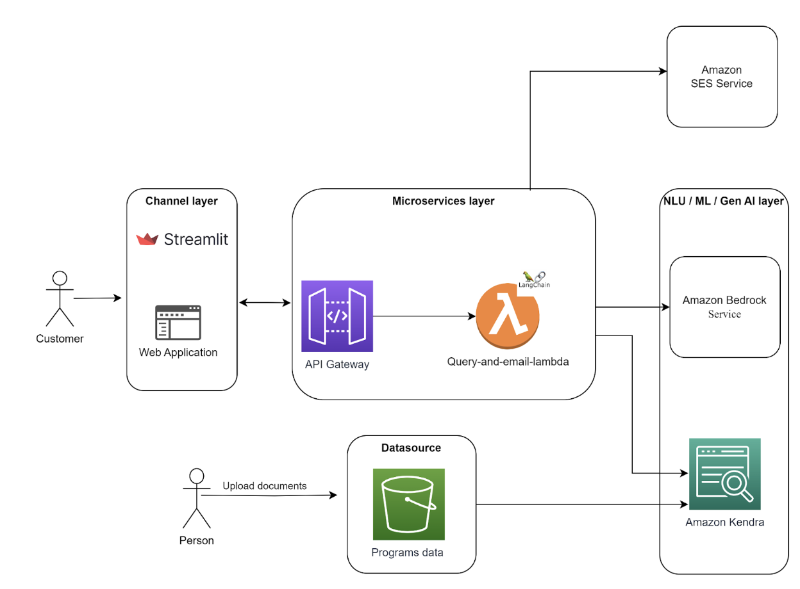

# Arizona Department of Homeland Security - Cyber Homeland Information Portal (CHIP)
The Arizona State University Cloud Innovation Center, in partnership with the Arizona Department of Homeland Security (AZ DOHS), is developing the Cyber Homeland Information Portal (CHIP). Accessible through the AZDOHS website, the CHIP application streamlines the user experience by not only providing immediate assistance but also offering document links for additional reference. This ensures that participants can verify the information they receive. Moreover, the application has the capability to  escalate to human support when the complexity of a query demands personalized assistance, thereby guaranteeing a smoother overall Cyber Readiness Program experience for participating organizations.

## Overview:-
The Arizona State University Cloud Innovation Center, in partnership with the Arizona Department of Homeland Security (AZ DOHS), is developing the Cyber Homeland Information Portal (CHIP), a prototype solution that uses generative AI to provide real time support for organizations participating in AZ DOHS’s Cyber Readiness Program on cyber security tool implementation. Organizations with little or no IT resources can now leverage tools to secure their information systems with the help of AZ DOHS and the CHIP application.

## Description:-
Small organizations participating in AZDOHS's Cyber Readiness Program encounter difficulties in grasping and applying the various cyber security resources. This results in delayed responses to their inquiries due to the constraints of a limited support staff. In response to this challenge, the innovative CHIP application has been developed, incorporating cutting-edge technologies such as AWS, Machine learning and Generative AI. The primary objective of this application is to furnish participants with real-time and concise answers to their queries.

## High Level Architecture:-
The project is developed using AWS and the Streamlit framework. The documents are stored in the S3 bucket as a data source. When a user enters a query through the user interface, the request goes to the API gateway, triggering the Lambda function. This function handles the retrieval of relevant text data and documents from Amazon Kendra, using the Langchain framework and bedrock service to work with the LLM model. Afterward, the LLM's response is passed as a response and displays on the user interface to the user. If the LLM can't provide a proper answer based on the obtained data, the query is passed on to a human. This is done by sending an email using Amazon SES service that includes the user's details and the specific question.

The architectural diagram: 

# Prerequisites
For the prerequisites, we need: 

1. We need `npm` as package manager to install dependencies
   
2. `aws cdk` needs to be installed
   
3. `docker` to create lambda layers in aws cdk
   
4. Access to AWS Bedrock models that needs to be configured from aws console
   
5. IAM user with access to Bedrock service 

6. Manually in the AWS Console create an SNS and create two verified identites for the email addresses that will be used to send and receive emails.
   
7. Manually create the AWS Kendra Index and get its Index ID.

# Deployment Guide:-
-> First we need to deploy the backend, then use the resources such as API to add to the Frontend.

Use `aws configure` to either select an existing profile or enter IAM access key and secret key to configure aws CLI

1. After cloning the repo, in the `Backend` folder in terminal.
2. Enter the values in `.env` for these: 
   1. `AWS_KENDRA=""` - Your AWS Kendra Index Index ID
   2. `SENDER_ADDRESS="""` - AWS SNS verified email address for sending emails
   3. `RECEIVER_ADDRESS=""` - AWS SNS verified email address for receiving emails 
   4. `ACCESS_KEY=""` - AWS Access Key ID with Bedrock access
   5. `SECRET_ACCESS_KEY=""` - AWS Secret Access Key with Bedrock access
   6. `AWS_REGION=""` - AWS Region you want to deploy the stack
3. Run the command `npm i` to install all the dependencies
4. Run the command `cdk synth` to start creating the cloudformation in the cdk.out folder
5. Run the command `cdk bootstrap` to bootstrap the project enviornment before deploying it.
6. Run the command `cdk deploy` to deploy the project and get the ouputs.
7. You will get the API: 
    `HS-llm_generate_api-demo` and it has two methods:
    1. `/generatellmdev` - to generate the response from the LLM model 
    2. `/sendemail` - to send the email
   

-> Now, we need to deploy the frontend:

1. Go to the folder `Frontend`, and enter the vaalues in `app.py` folder:
   1. `api_endpoint= "XXXXXXXXXXXXXXXXXXX/generatellmdev"`- the Query method in the API
   2. `api_email_send_endpoint = "XXXXXXXXXXXXXXXXXXX/sendemail"` - the method to send the email

After creating a virtual env for python and activating it,
Now you can run `pip install -r requirements.txt` to install all the requirements locally

-> You can run the streamlit locally by running this command- `streamlit run app.py`

-> For deploying it on EC2, you can follow instructions in the `Homeland/assests/docs/Deploying Streamlit App on EC2.pdf`

*Note: You need to upload the files in S3 by going to the AWS Console and then sync the Kendra Index by clicking on the "sync now" button to get the latest documents in the Kendra Index.*

# User Guide:-

The process involves the two steps:

1. Uploading documents and Querying using User interface.

2. Uploading the documents into the S3 bucket and Kendra Sync:

### Uploading the documents into the S3 bucket and Kendra Sync:
It is a manual process. The uploading of the latest version of an existing document or uploading a new document has to be done manually. Once the documents are uploaded, the kendra index has to be synced. The below shows the steps with the screenshots.

#### 1. Access S3 Service:
In the AWS Management Console, navigate to the "Services" dropdown.
Search for  "S3".

#### 2. Select Existing Bucket:
From the list of buckets, click on the name of the existing bucket where you want to upload documents.

#### 3. Upload Documents:
Within the selected bucket, click on the "Upload" button. Choose the files you want to upload and follow the prompts to complete the upload.

#### 4. Access Amazon Kendra:
In the AWS Management Console, navigate to the "Services" dropdown. Search for  "Amazon Kendra" 

#### 5. Select Index:
Choose the Kendra index that corresponds to the data source you want to synchronize.

#### 6. Navigate to Data Sources and Sync:
In the Kendra index settings, find the section related to "Data Sources''. Click on the data source and click in the Sync option.

### Querying using the User Interface 
The user interface features a text box for users to input their queries.

-> Users can enter a query and receive a concise response along with relevant documents. To access the document, users can simply click on the provided link and then input your query in the query bar.

-> Providing an Email option if the tool not able to answer the query:
The tool additionally offers the option for users to input their email addresses, facilitating the sending of queries to the support team.

# Credits:-

Developer: 
    [Vishnusai kandati](https://www.linkedin.com/in/vishnusai-kandati/)

Developer: 
    [Loveneet Singh](https://www.linkedin.com/in/loveneet-singh-6bb2851ba/)

Sr. Program Manager, AWS: 
    [Jubleen Vilku](https://www.linkedin.com/in/jubleen-vilku/)

Architect:
    [Arun Arunachalam](https://www.linkedin.com/in/arunarunachalam/)

General Manager, ASU: 
    [Ryan Hendrix](https://www.linkedin.com/in/ryanahendrix/)

This project is designed and developed with guidance and support from the [ASU Cloud Innovation Center](https://smartchallenges.asu.edu) and the City of Phoenix, Arizona teams.
